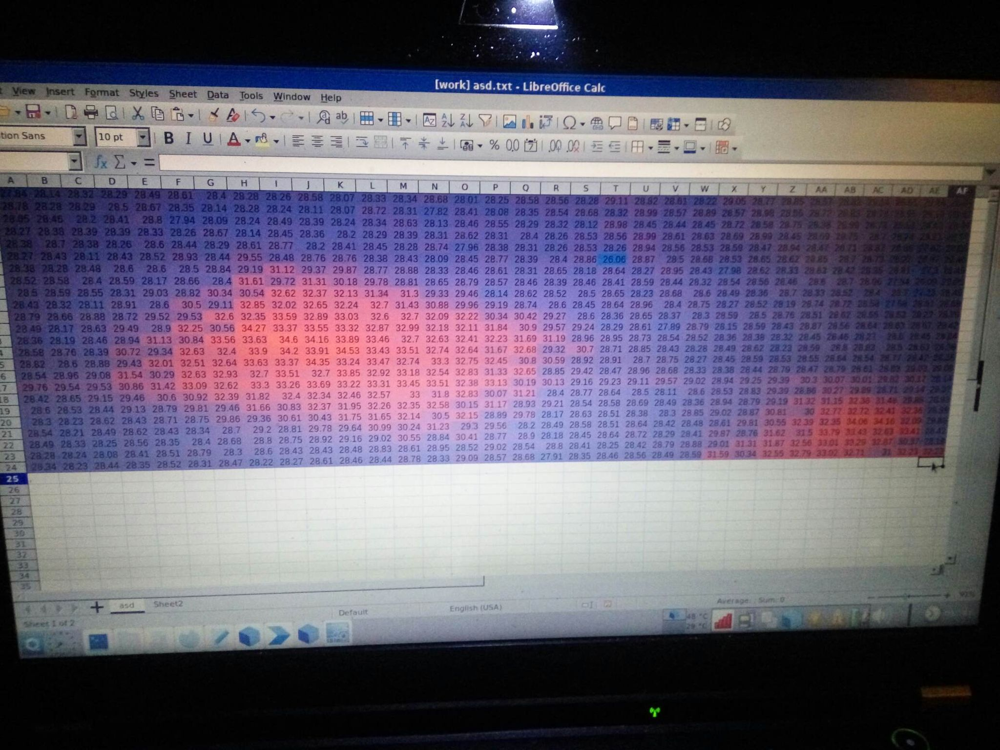
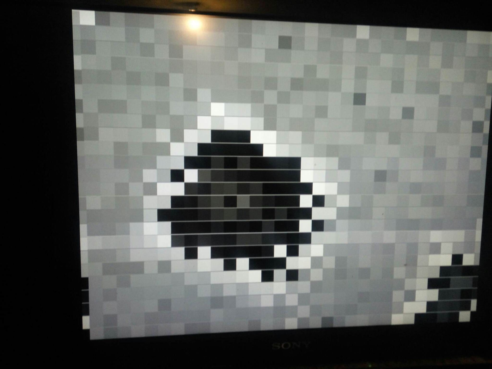
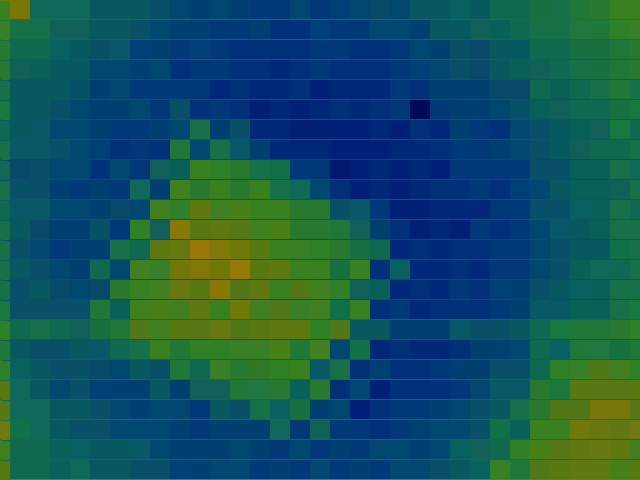

# vhdlp5
## Melexis MLX90640 in VHDL on FPGA
### This project calculate example data from datasheet https://github.com/adafruit/Adafruit_MLX90640/blob/master/MLX90640%20example%20data.xlsx and display this on VGA display 640x480.

### I am not responsible for incorrect operation or misuse of the project
### UPDATE: use less resourcess, speed calculations, add color heatmap

git diff b2ffe6056c2d7b9b2d4b3ed917050d28610628cc..1eae55edd3fda56ed9e449b763673da1b78408de test1.syr

