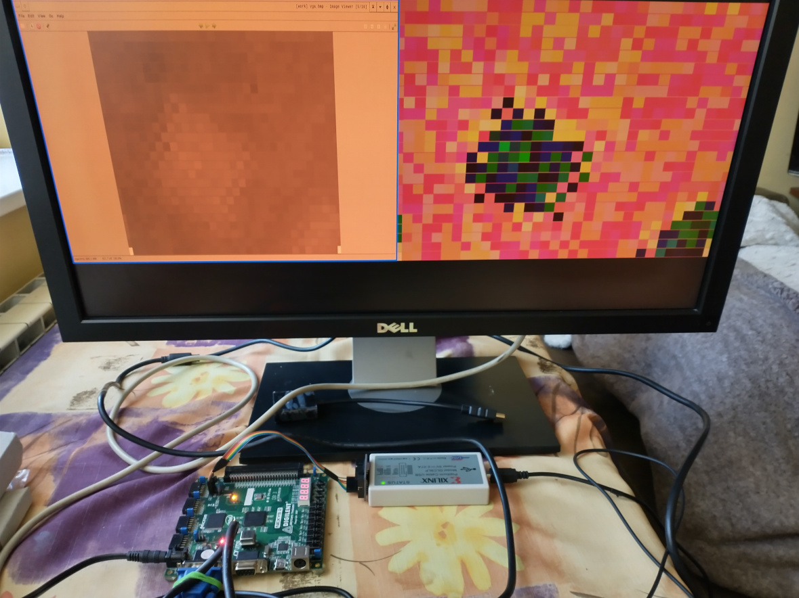
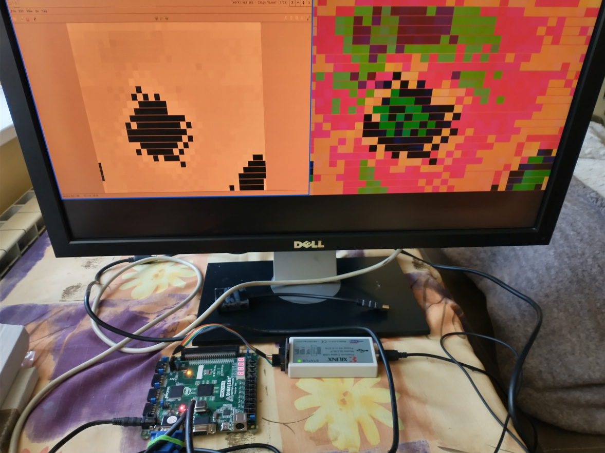

# vhdlp5
## Melexis MLX90640 in VHDL on FPGA
### This project calculate example data from datasheet https://github.com/adafruit/Adafruit_MLX90640/blob/master/MLX90640%20example%20data.xlsx and display this on VGA display 640x480.

### I am not responsible for incorrect operation or misuse of the project
#
## Update : Fit project in Digilent Nexys 2 (xc3s1200e-fg320-4) - only RGB332 color palette

